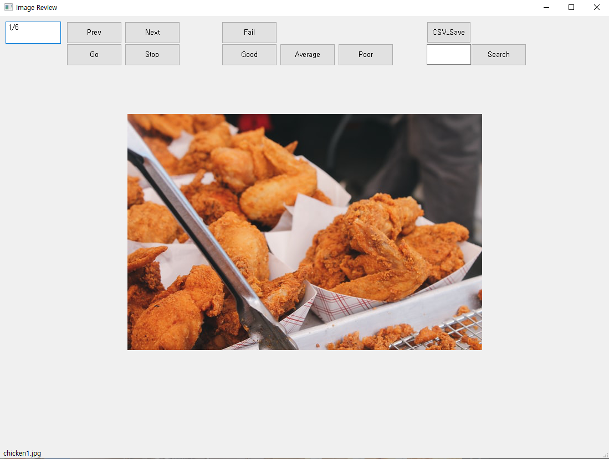

<h1 align="center">
    <p>Review image easily</p>
</h1>

A pyqt tool to effectively review images & move them to specific directory.

## Demo

<div align="center">
  
</div>

## Features

- **Prev, Next** : show previous, next image 
- **Good, Average, Poor, Fail** : move the current image to each directory
- **Go, Stop** : show next image automatically after 2 seconds
- **CSV Save** : save the list of "Fail" images in CSV format
- **Search** : move to the image at the input index

## Installation & Usage

1. Clone this repository

2. Install pyqt5 using `pip install pyqt5`

3. Type `python main.py`  

    You can specify  
    - directory of images to review   
    - paths to save CSV files  
    - image type  
    ```bash
    # example
    python main.py --img_path='path/to/your/imgs' --csv_path='path/to/save/CSV' --type='png'
    ```

## Directory stucture

```bash
..
├── img_path
│     ├──img1.png
│     ├──img2.png
│     ├──img3.png
│     └── ...
├── good
├── average
├── poor
└── fail
```

## Techs

- Made with python and pyqt.

## Reference

- chicken image: [Brian Chan](https://unsplash.com/@tigerrulezzz) on [Unsplash](https://unsplash.com/)

## License

This repository is licensed under the MIT License.